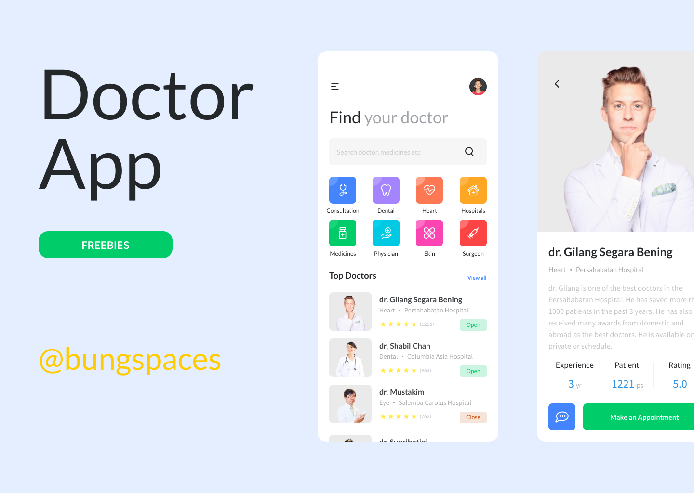
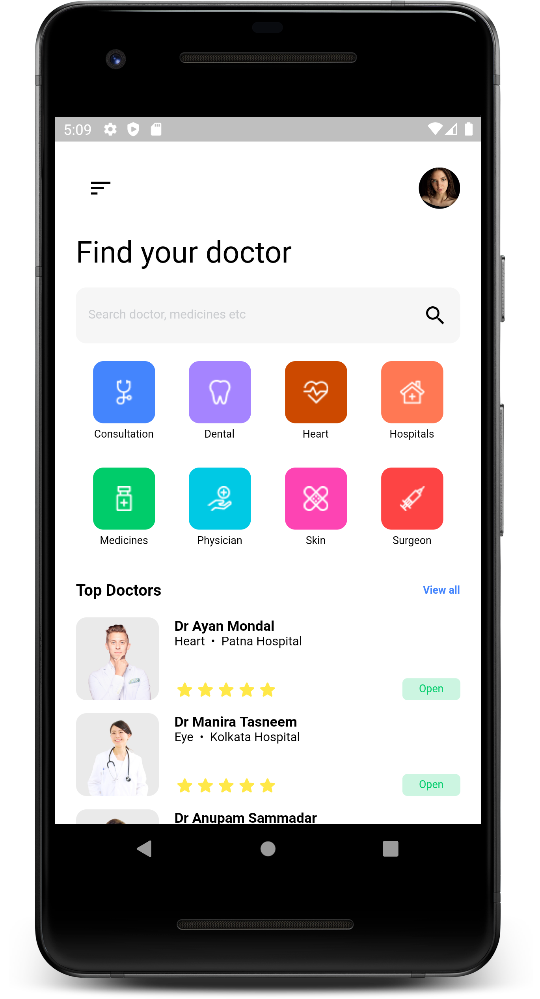
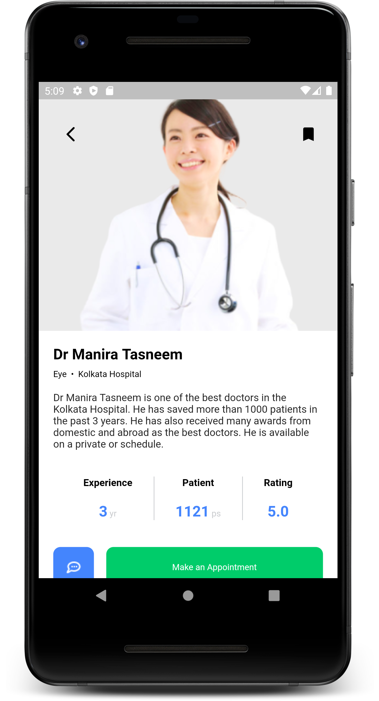
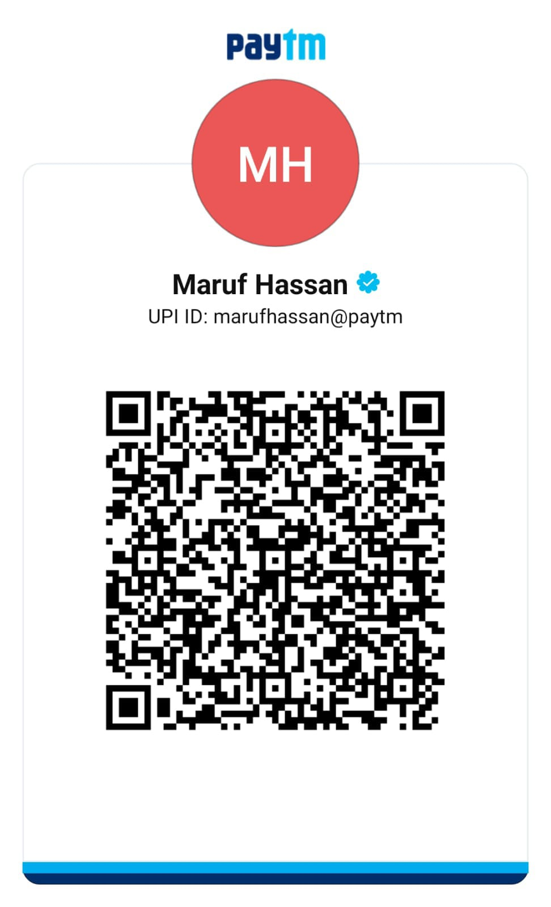

# Doctor App UI

App UI for Doctor & Health app designed by [Gilang Segara](https://www.figma.com/@bungspaces) available on [Figma Communtiy](https://www.figma.com/community/file/867963472996705280)

## Table of Contents

- [Design](#design)
- [Screenshots](#screenshots)
- [Contact me](#contact-me)
- [Support me](#support-me)

## Design

## Screenshots

<table>
  <tr>
    <td>
Home Screen
</td>
    <td>
Doctor Screen
</td>
    
  </tr>
  <tr>
    <td valign="top"></td>
    <td valign="top"></td>   
  </tr>
 </table>

## Contact me

## Support me

My work is free and I don't like hiding my work behind a paywall like others so that everyone can benefit from it and open source community can grow and prosper with it.

If you like my work and can support me to make more open source UI designs then do consider supporting me. 

### Tap & Pay (Free)

If you cannot support me financially, you can donate to me with the click of a button free of cost on [Zink](https://zink.tips/marufhassan) which is a micro-donation platform.

### UPI

Indians can use any UPI app to support me.

### Card/Paypal

Other countries can help me using Ko-fi

## License

- **[MIT license](https://github.com/zyllus17/doctor-app-ui/blob/master/LICENSE)**
